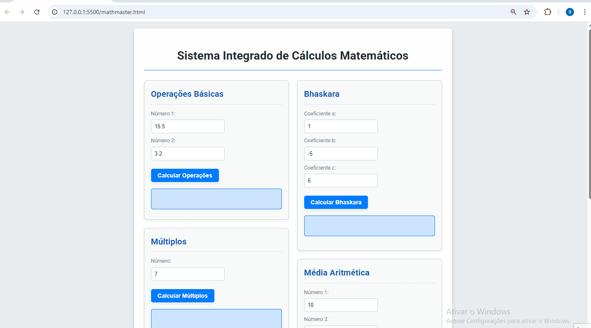

# 🧮 Calculadora Matemática Avançada

 

Este projeto foi desenvolvido como parte da disciplina Eletiva Programação WEB, demonstrando na prática a criação de uma calculadora completa com operações básicas e avançadas utilizando HTML, CSS e JavaScript. A aplicação oferece desde cálculos simples até fórmulas matemáticas complexas como Bhaskara.

---

## Contexto Acadêmico 🎓

Este trabalho foi realizado como atividade prática da matéria Eletiva Programação WEB, com os seguintes objetivos:

Implementar lógica matemática em JavaScript

Desenvolver interface intuitiva para cálculos diversos

Praticar manipulação do DOM em tempo real

Aplicar tratamento de erros e validações

Consolidar conhecimentos em CSS Flexbox

### O projeto reforçou competências essenciais como:

✔️ **Estruturação semântica com HTML5**  
✔️ **Estilização responsiva com CSS3**  
✔️ **Programação funcional em JavaScript**  
✔️ **Validação de inputs do usuário**  

---

## 🚀 Funcionalidades

✔️ **Operações Básicas**: Adição, subtração, multiplicação e divisão  
✔️ **Múltiplos**: Dobro, triplo, quádruplo, quíntuplo e sêxtuplo  
✔️ **Potências**: Quadrado, cubo, quarta, quinta e sexta potência  
✔️ **Raiz Quadrada**  
✔️ **Bhaskara**: Cálculo de raízes de equações quadráticas  
✔️ **Média Aritmética** entre 4 números  
✔️ **Verificador** de números pares/ímpares

---

## Tecnologias Utilizadas 💻

🖥️ **HTML5** - Estrutura semântica e acessível  
🎨 **CSS3** - Layout com Flexbox e design responsivo  
⚙️ **JavaScript** - Lógica matemática e interatividade  
