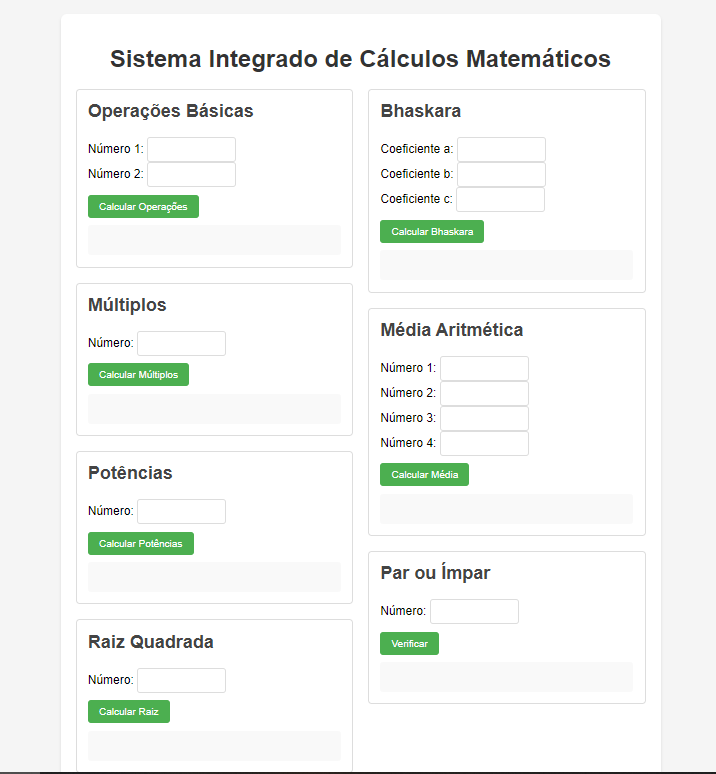

# 🧮 Calculadora Matemática Avançada

 

Uma aplicação web interativa que realiza diversos cálculos matemáticos, desde operações básicas até fórmulas complexas como Bhaskara. Desenvolvida como exercício prático para consolidar conhecimentos em **HTML, CSS e JavaScript**.

---
## 🚀 Funcionalidades

✔️ **Operações Básicas**: Adição, subtração, multiplicação e divisão  
✔️ **Múltiplos**: Dobro, triplo, quádruplo, quíntuplo e sêxtuplo  
✔️ **Potências**: Quadrado, cubo, quarta, quinta e sexta potência  
✔️ **Raiz Quadrada**  
✔️ **Bhaskara**: Cálculo de raízes de equações quadráticas  
✔️ **Média Aritmética** entre 4 números  
✔️ **Verificador** de números pares/ímpares

---
## 🛠️ Tecnologias Utilizadas

- **HTML5** (semântico e acessível)  
- **CSS3** (Flexbox, responsividade)  
- **JavaScript Vanilla** (DOM, tratamento de erros)

---
